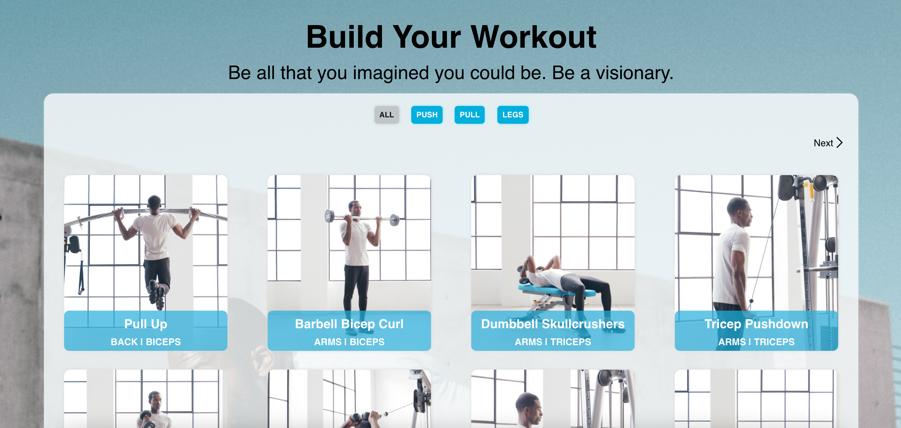
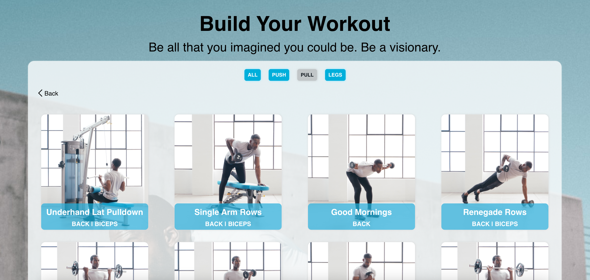

<h1>Vegan Pals</h1>

## Live Link

Click [here](https://stormy-stream-13655.herokuapp.com/) to view the project on Heroku.

<h2> Table of Contents </h2>

- [Live Link](#live-link)
- [About the Project](#about-the-project)
- [Key Features](#key-features)
  - [Technologies Used](#technologies-used)
- [Screenshots](#screenshots)
- [Getting Started](#getting-started)

## About the Project

This application has been coded to meet the brief of an old Gymshark technical challenge.
The application levereages the axios npm package to retrieve fitness exercises from an API endpoint and displays them in a device responsive, clean interface which has been coded in ReactJs.

## Key Features

- pagination
- filtering of exercises base on the push/pull/legs workout split
- exercise images are displayed in accordance to the type (male/female) chosen by the user
- device responsive UI
- basic tests for filtering logic and component rendering

### Technologies Used

- Reactjs
- axios
- react-testing-library

## Screenshots

Homepage


Exercises results page


Exercises results page with applied filter


Exercise preview


## Getting Started

- Clone the GitHub project into your local machine
- Navigate into the project

```
git clone https://github.com/dominikacookies/exercise-finder.git
cd exercise-finder
code .
npm i
npm run start
```
